# Yapgan

Self-Hosted note application with semantic search

## 🌟 Features

- **Universal Capture**: Save highlighted text from any website with one click
- **Browser Extension**: Chrome/Brave extension for seamless note capture
- **Smart Search**: Full-text search with semantic capabilities
- **Tag Management**: Auto-create and organize notes with tags
- **Self-Hosted**: Privacy-first, runs on your infrastructure
- **RESTful API**: Built with Go + Echo framework
- **JWT Auth**: Secure authentication with access and refresh tokens

## Quick Links

- [API Requests File](api-requests.http) - Interactive HTTP requests for all endpoints

## Getting Started

### 1. Start with docker compose

```bash
# Start from docker compose (Embedding Service + Front + Backend + PostgreSQL + Qdrant)
docker-compose up -d
```

You need to wait embedding model download on embedding service.

```
model.onnx_data: 100%|██████████| 2.24G/2.24G
```

then you can continue to create notes. If embedding is not available, notes cannot be able to index to Qdrant. Search and Vector space will not work.

### 2. Create User Account

Go http://localhost:5173 on browser and create your user

### 3. Install Browser Extension

**Quick steps:**

1. Open `chrome://extensions/`
2. Enable "Developer mode"
3. Click "Load unpacked"
4. Select `extensions/browser/` directory
5. Click extension icon and login

### 4. Capture Your First Note

1. Go to any website
2. Highlight some text
3. Click Yapgan extension icon (⭐)
4. Enter title and optional tags
5. Click "Save" ✅

Done! Your note is saved and searchable.

## Screenshots


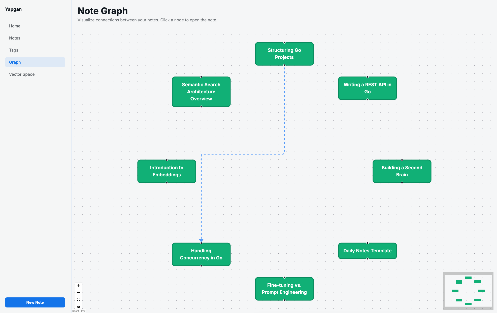

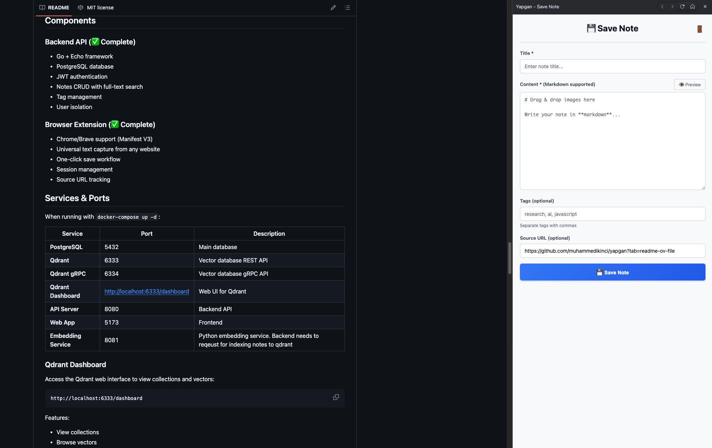

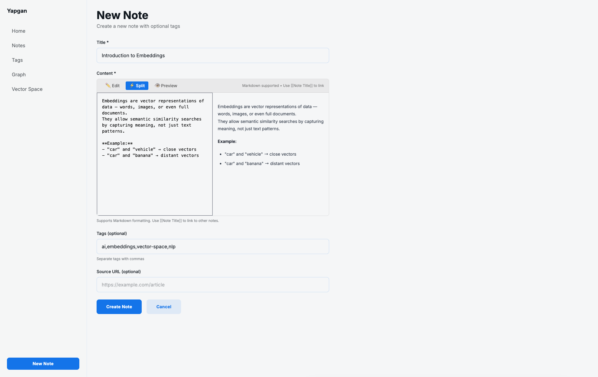

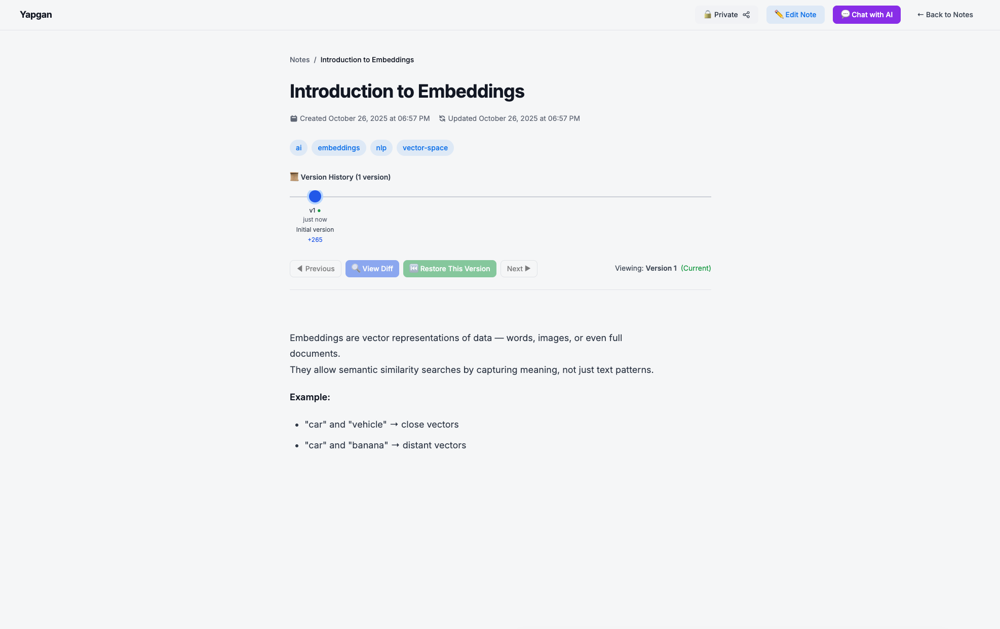

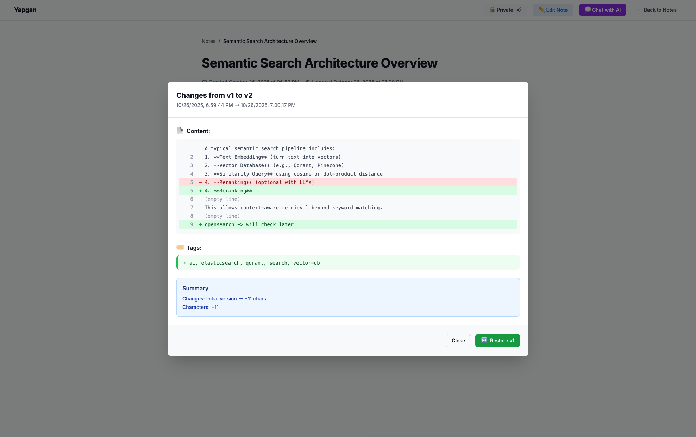

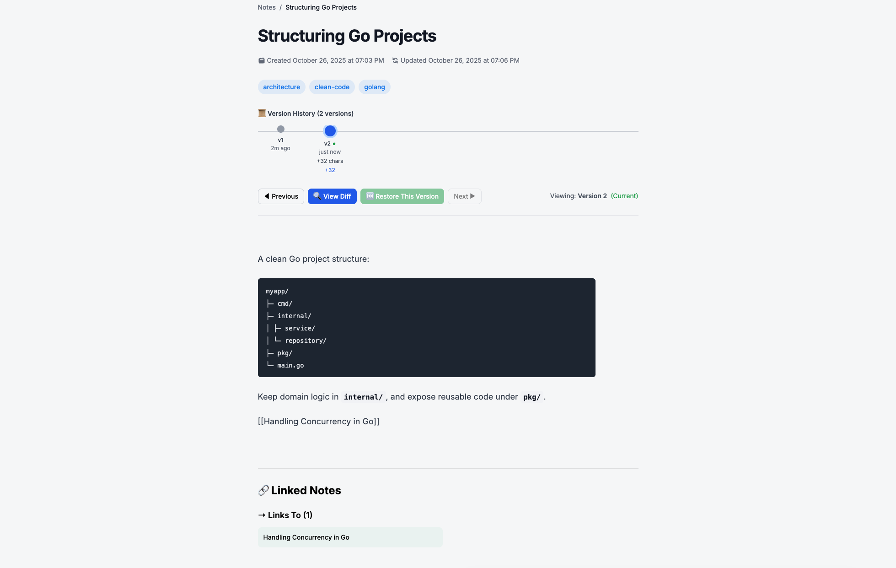

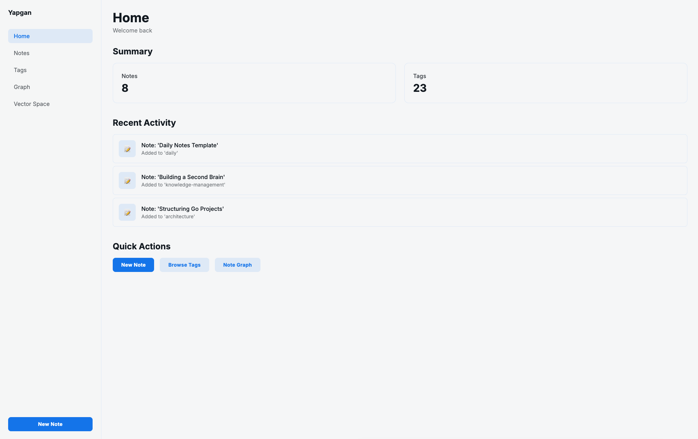

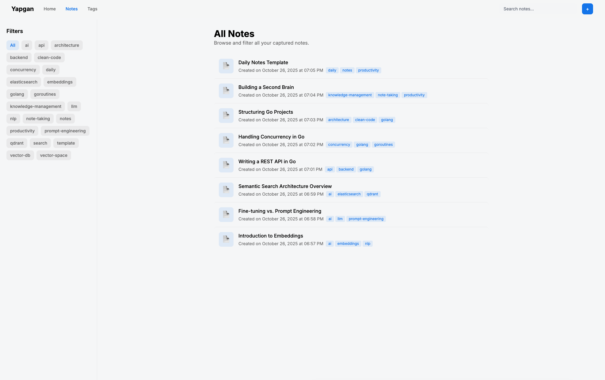

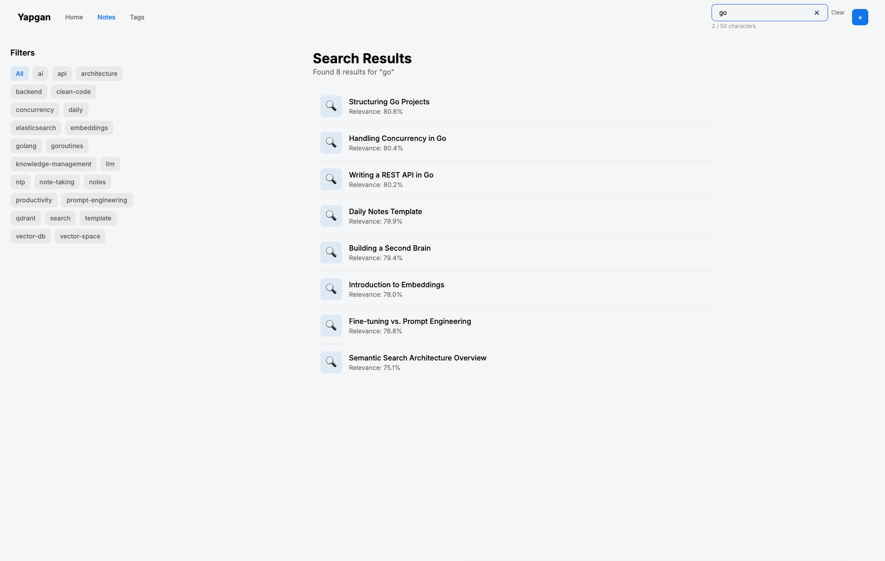

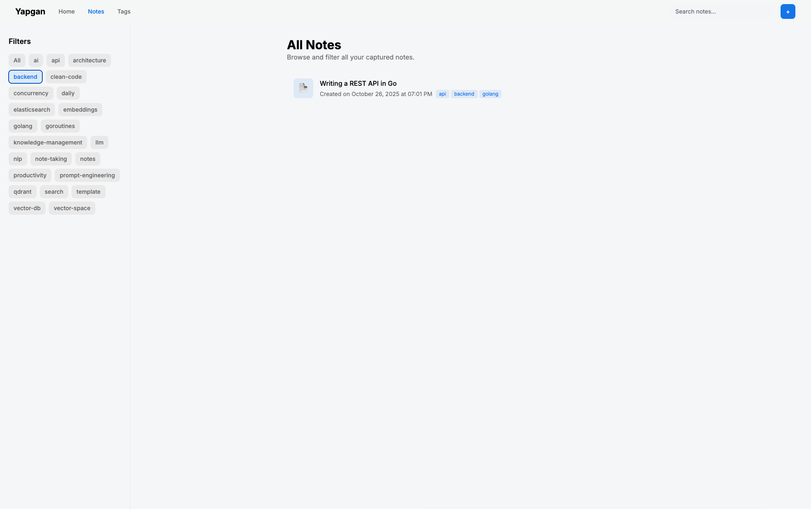

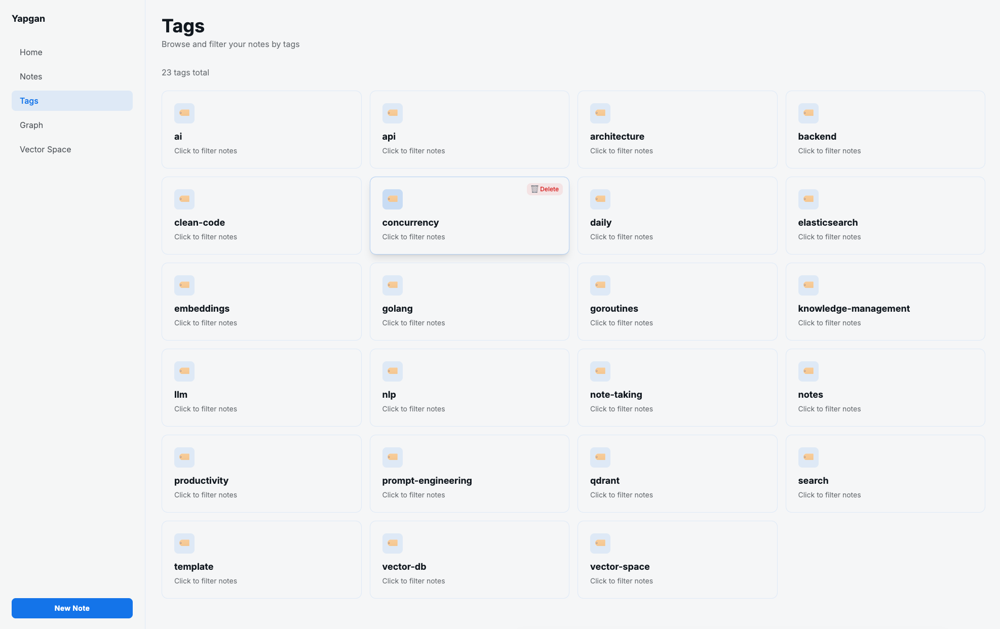

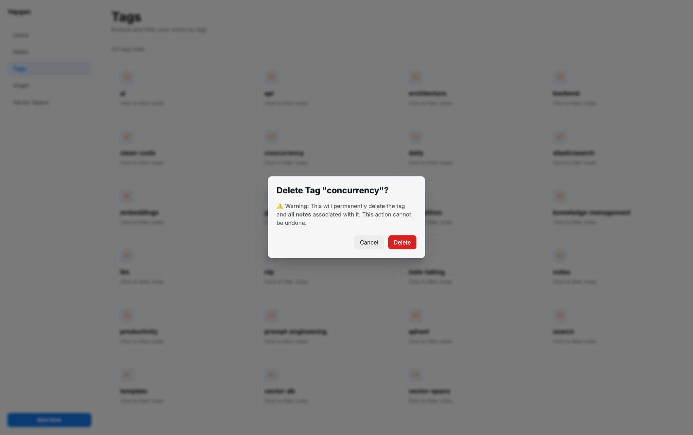

## Components

### Backend API (✅ Complete)

- Go + Echo framework
- PostgreSQL database
- JWT authentication
- Notes CRUD with full-text search
- Tag management
- User isolation

### Browser Extension (✅ Complete)

- Chrome/Brave support (Manifest V3)
- Universal text capture from any website
- One-click save workflow
- Session management
- Source URL tracking

## Services & Ports

When running with `docker-compose up -d`:

| Service               | Port                            | Description                                                                     |
| --------------------- | ------------------------------- | ------------------------------------------------------------------------------- |
| **PostgreSQL**        | 5432                            | Main database                                                                   |
| **Qdrant**            | 6333                            | Vector database REST API                                                        |
| **Qdrant gRPC**       | 6334                            | Vector database gRPC API                                                        |
| **Qdrant Dashboard**  | http://localhost:6333/dashboard | Web UI for Qdrant                                                               |
| **API Server**        | 8080                            | Backend API                                                                     |
| **Web App**           | 5173                            | Frontend                                                                        |
| **Embedding Service** | 8081                            | Python embedding service. Backend needs to reqeust for indexing notes to qdrant |

### Qdrant Dashboard

Access the Qdrant web interface to view collections and vectors:

```
http://localhost:6333/dashboard
```

Features:

- View collections
- Browse vectors
- Search and filter
- Monitor cluster health

## Setup

### Prerequisites

- Go 1.21+
- PostgreSQL 15+
- Docker & Docker Compose (recommended)

### Configuration

Configuration is managed through TOML files in the `.conf/` directory.

**Available environments:**

- `dev` - Development environment (`backend/.conf/dev.toml`)
- `docker` - Docker environment (`backend/.conf/docker.toml`)

**Configuration structure:**

```toml
[server]
port = "8080"

[database]
host = "localhost"
port = "5432"
user = "postgres"
password = "postgres"
name = "yapgan"
sslmode = "disable"

[jwt]
secret = "your-secret-key-minimum-32-characters"
refresh_secret = "your-refresh-secret-minimum-32-characters"
access_token_expiry = "15m"
refresh_token_expiry = "168h"

[cors]
allowed_origins = ["http://localhost:3000"]

[pagination]
default_page_size = 20
max_page_size = 100
```

**Create your own config:**

```bash
# Copy dev config for local development
cp backend/.conf/dev.toml backend/.conf/local.toml

# Edit local.toml with your settings
# local.toml is gitignored
```

### Database Setup

#### Using Docker Compose (Recommended)

```bash
docker-compose up -d
```

This will start PostgreSQL and automatically run migrations.

#### Manual Setup

1. Create database:

```bash
createdb yapgan
```

2. Run migrations:

```bash
psql -d yapgan -f backend/migrations/001_create_users.sql
psql -d yapgan -f backend/migrations/002_create_notes_and_tags.sql
# ... and other migration files
```

### Run

**Development (uses dev.toml):**

```bash
cd backend
ENV=dev go run cmd/api/main.go
```

**Production (uses prod.toml):**

```bash
cd backend
ENV=prod go run cmd/api/main.go
```

**Custom config:**

```bash
cd backend
ENV=local go run cmd/api/main.go
```

**Build and run:**

```bash
cd backend
go build -o bin/yapgan cmd/api/main.go
ENV=dev ./bin/yapgan
```

## API Endpoints

### Health Check

```bash
GET /health
```

### Authentication

**Register**

```bash
POST /api/auth/register
Content-Type: application/json

{
  "email": "user@example.com",
  "password": "yourpassword"
}
```

**Login**

```bash
POST /api/auth/login
Content-Type: application/json

{
  "email": "user@example.com",
  "password": "yourpassword"
}

# Response includes access_token and refresh_token
```

**Get Current User**

```bash
GET /api/me
Authorization: Bearer <access_token>
```

### Notes

**Create Note**

```bash
POST /api/notes
Authorization: Bearer <access_token>
Content-Type: application/json

{
  "title": "My Note Title",
  "content_md": "This is **markdown** content",
  "source_url": "https://example.com/source",
  "tags": ["tag1", "tag2"]
}
```

**Get Note**

```bash
GET /api/notes/:id
Authorization: Bearer <access_token>
```

**Update Note**

```bash
PUT /api/notes/:id
Authorization: Bearer <access_token>
Content-Type: application/json

{
  "title": "Updated Title",
  "content_md": "Updated content",
  "tags": ["new-tag"]
}
```

**Delete Note**

```bash
DELETE /api/notes/:id
Authorization: Bearer <access_token>
```

**List Notes**

```bash
GET /api/notes?page=1&per_page=20&search=keyword&tags=tag1,tag2
Authorization: Bearer <access_token>

# Query Parameters:
# - page: Page number (default: 1)
# - per_page: Items per page (default: 20, max: 100)
# - search: Full-text search query
# - tags: Filter by tags (comma-separated)
```

### Tags

**List All Tags**

```bash
GET /api/tags
Authorization: Bearer <access_token>
```

## Example Usage

```bash
# Login
TOKEN=$(curl -s -X POST http://localhost:8081/api/auth/login \
  -H "Content-Type: application/json" \
  -d '{"email":"test@example.com","password":"test123"}' \
  | jq -r '.access_token')

# Create a note
curl -X POST http://localhost:8081/api/notes \
  -H "Authorization: Bearer $TOKEN" \
  -H "Content-Type: application/json" \
  -d '{
    "title": "Claude Code Review Tips",
    "content_md": "Always check for **edge cases** and proper error handling.",
    "source_url": "https://claude.ai/chat/abc123",
    "tags": ["programming", "code-review", "claude"]
  }'

# List notes
curl -X GET "http://localhost:8081/api/notes?page=1&per_page=10" \
  -H "Authorization: Bearer $TOKEN"

# Search notes
curl -X GET "http://localhost:8081/api/notes?search=edge+cases" \
  -H "Authorization: Bearer $TOKEN"

# Filter by tag
curl -X GET "http://localhost:8081/api/notes?tags=programming" \
  -H "Authorization: Bearer $TOKEN"
```

## Architecture

- **Viper Configuration**: TOML-based configuration management with environment support
- **Consumer-Defined Interfaces**: Interfaces are defined where they're used, not where they're implemented
- **Use-Case Organization**: Code organized by feature (auth, notes, tags, search)
- **Manual Dependency Injection**: All dependencies wired in `cmd/api/main.go`
- **Repository Pattern**: Data access abstracted behind interfaces

## Project Structure

```
yapgan/
├── backend/                # Backend API (Go)
│   ├── .conf/             # Configuration files (TOML)
│   │   ├── dev.toml      # Development config
│   │   └── prod.toml     # Production config
│   ├── cmd/api/          # Application entry point
│   ├── config/           # Configuration loader (Viper)
│   ├── internal/
│   │   ├── auth/         # Authentication use case
│   │   ├── chat/         # AI chat functionality
│   │   ├── notes/        # Notes use case
│   │   ├── usage/        # Usage tracking
│   │   └── server/       # HTTP server setup
│   ├── migrations/       # SQL migrations
│   ├── go.mod            # Go dependencies
│   └── README.md         # Backend documentation
├── web-app/              # Frontend (React + TypeScript)
│   ├── src/
│   │   ├── components/   # Reusable components
│   │   ├── pages/        # Page components
│   │   └── services/     # API integration
│   ├── package.json
│   └── README.md         # Frontend documentation
├── extensions/
│   └── browser/          # Browser extension (Chrome/Brave)
│       ├── manifest.json
│       ├── popup/        # Extension UI
│       ├── content.js    # Text capture script
│       └── background.js # Service worker
├── docs/                 # Documentation
├── memory-bank/          # Project memory & context
└── docker-compose.yml    # Docker setup (PostgreSQL + Qdrant)
```

## Contributing

This is currently a personal project in active development. Feedback and suggestions welcome!

## License

MIT License - See LICENSE file
